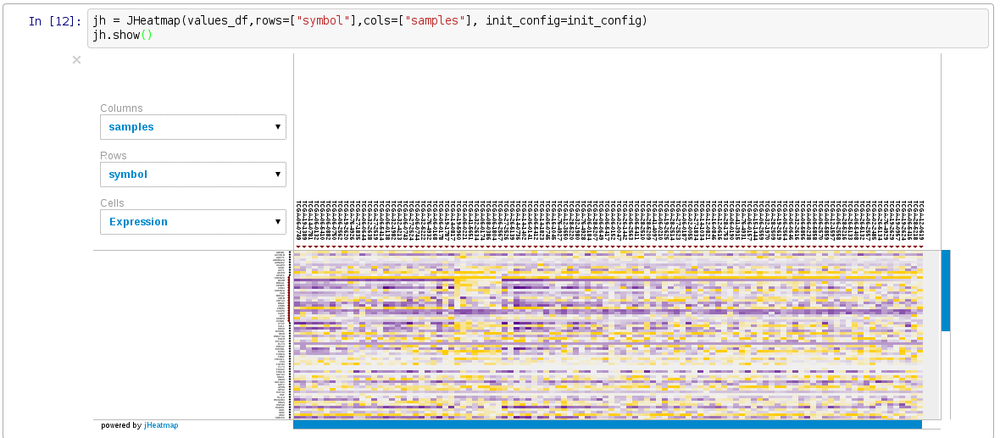

jHeatmap for iPython Notebook
==============================

*jHetmap interactive heatmaps for the web browser*

jHeatmap can be used as IPython notebook widget framework to make interactive heatmaps.

- **Youtube video**: A showcase of jHeatmap https://www.youtube.com/watch?v=9bO1fCJhJyo

Installation
==================

- Make sure **dependencies** are installed: `python3`, `pandas`, `ipython[notebook]`
- Install this library: `python setup.py install`
- Check out the **demo notebook** `demo jheatmap.ipynb`
- Check out **documentation** of the javascript at jHeatmap website: http://jheatmap.github.io/jheatmap/
- **Start being productive** and cite us

TODO list
===============
 - Make it work in ContainerWidgets : popups, tab, etc
 - convert canvas to img
